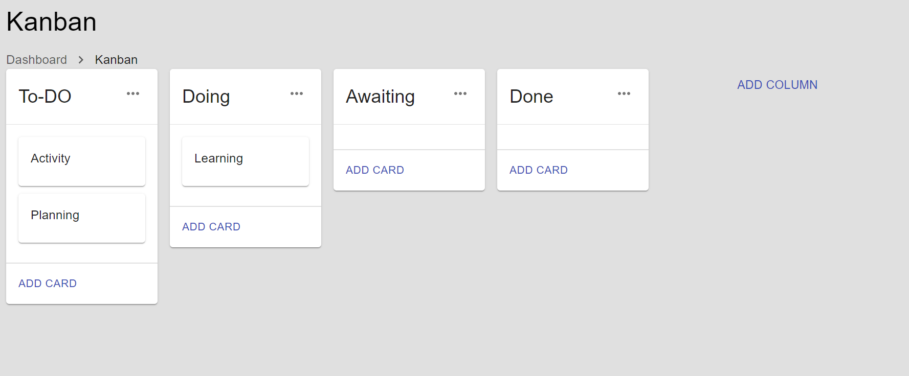

# Kanban-Board App
A Kanban board serves as an agile project management tool designed to visualize the ongoing tasks. It helps agile teams in bringing structure to their daily work routines.

screenshop

Features
Columns
Allows users to create, rename, and delete columns within a limit of 5. Dynamically hides the "Add Column" button and notifies users upon reaching the column limit.

Tasks
Enables users to create, edit, and delete tasks within the columns.

Drag and Drop
Implements drag-and-drop functionality for seamless task movement within and between columns.

## Project name

Stella project

## Author name

**Stella walya**

## Description of project

 Agile project management tool that helps visualize work been done

## Technologies

1. next js,

1.  Visual Studio Code

1.  material UI

1. React 

1. material UI

1. Vercel

 

*
This is a work in progress project more technologies to be added with time.
*

## Project setup instructions

* Clone the project by running : git clone https://github.com/swalya/kanban_app/tree/main/kanban

* Use your favourite editor to open the folder (example Visual Studio Code ).

* Review the code and if there are any changes you believe would assist to improve the project raise a pull request.

## Live site link

View the live link at : [Kanbanboard Link](https://github.com/swalya/kanban_app/tree/main/kanban
 "kanbanboard")

## Support and contact details

{If you run into any issues or have questions,ideas and concerns feel free to reach out via email stellawalya27@gmail.com

> *Great projects are built through collaboration, together we can go far .*

## Copyright and license information

Copyright (c) {2022} **{Stella walya}**

